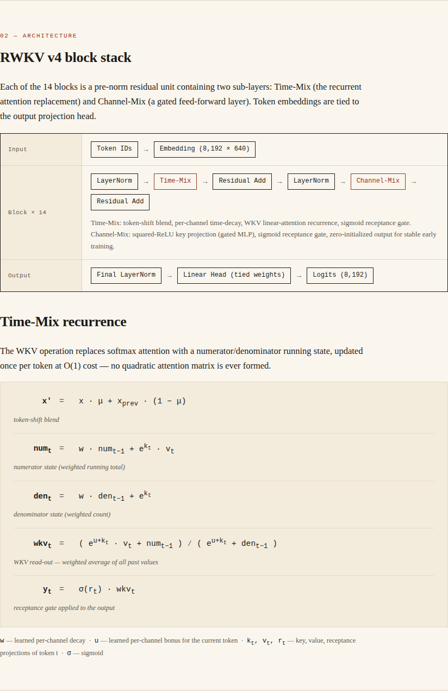

# GitHub Setup Instructions

## ✅ ΤΟ ΕΧΕΙΣ ΗΔΗ ΑΝΕΒΑΣΕΙ!

Το repository είναι ήδη στο:
**https://github.com/konpep-dev/Aether-RWKV-**

---

## Ενεργοποίηση GitHub Pages

### 1. Πήγαινε στα Settings

Μπες στο repository settings:
**https://github.com/konpep-dev/Aether-RWKV-/settings/pages**

### 2. Διαμόρφωση Pages

Στην ενότητα **"Build and deployment"**:

- **Source**: Deploy from a branch
- **Branch**: `main` (ή `master`)
- **Folder**: `/docs` ← **ΣΗΜΑΝΤΙΚΟ!**
- Κάνε κλικ στο **Save**

### 3. Περίμενε

Μετά από 2-3 λεπτά, το GitHub θα δημοσιεύσει το site στο:

```
https://konpep-dev.github.io/Aether-RWKV-/
```

Θα δεις ένα μήνυμα στο banner:
> "Your site is live at https://konpep-dev.github.io/Aether-RWKV-/"

---

## Επαλήθευση

Μόλις ενεργοποιηθεί το GitHub Pages:

1. **Model Card**: https://konpep-dev.github.io/Aether-RWKV-/
2. **README Badge**: Θα λειτουργεί το "Model Card - View" button
3. **Εικόνες**: Οι 9 εικόνες στο README θα φορτώνουν σωστά από το `docs/images/`

---

## Troubleshooting

### Οι εικόνες δεν φορτώνουν στο README

Βεβαιώσου ότι τα paths είναι σωστά:
```markdown
  ✅
```

**Όχι:**
```markdown
  ❌
  ❌
```

### Το HTML δεν φορτώνει σωστά

1. Έλεγξε ότι το `docs/_config.yml` έχει:
   ```yaml
   baseurl: "/Aether-RWKV-"
   url: "https://konpep-dev.github.io"
   ```

2. Βεβαιώσου ότι το GitHub Pages source είναι στο `/docs`

### 404 Error

- Περίμενε 3-5 λεπτά μετά την ενεργοποίηση
- Έλεγξε ότι ο branch είναι `main` (ή `master`)
- Έλεγξε ότι το folder είναι `/docs`
- Refresh το cache του browser (Ctrl+F5)

---

## Ενημέρωση Περιεχομένου

Αν κάνεις αλλαγές στο `docs/index.html` ή τις εικόνες:

```bash
git add docs/
git commit -m "Update model card"
git push
```

Το GitHub Pages θα ενημερωθεί αυτόματα σε 1-2 λεπτά.

---

## Links

- **Repository**: https://github.com/konpep-dev/Aether-RWKV-
- **Model Card (GitHub Pages)**: https://konpep-dev.github.io/Aether-RWKV-/
- **Issues**: https://github.com/konpep-dev/Aether-RWKV-/issues

---

**Ready! 🚀** Το GitHub Pages θα είναι live σε λίγα λεπτά!
