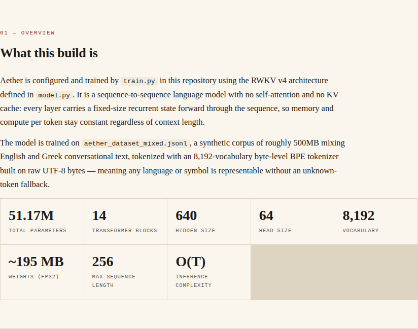
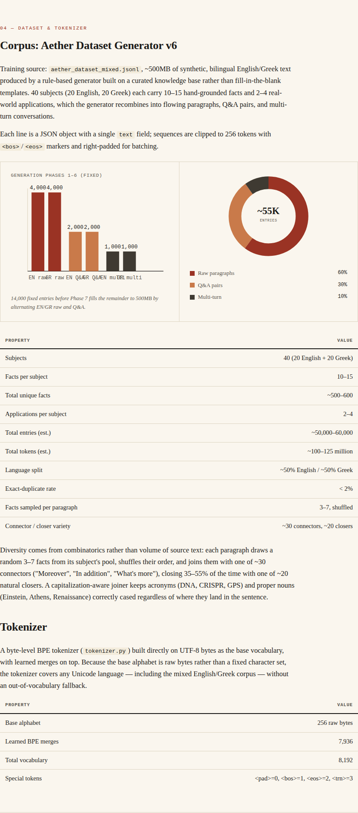
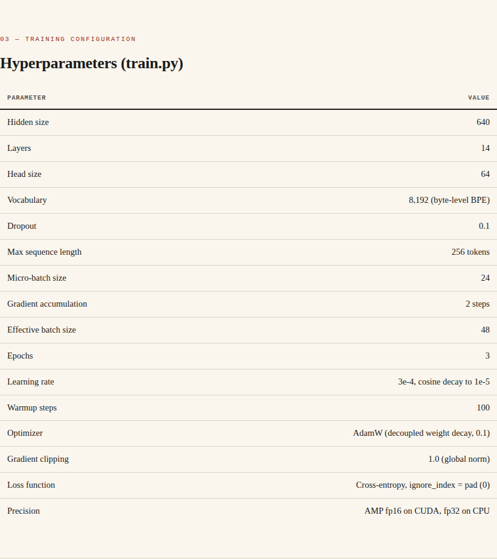
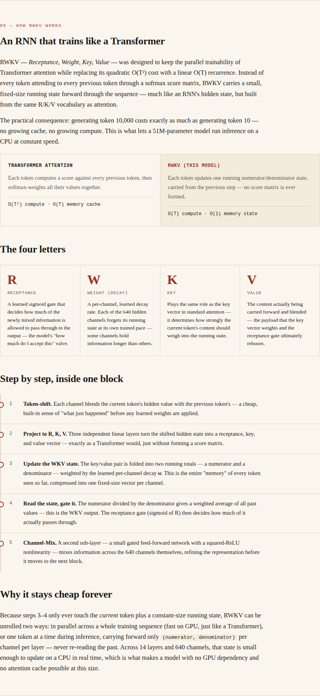
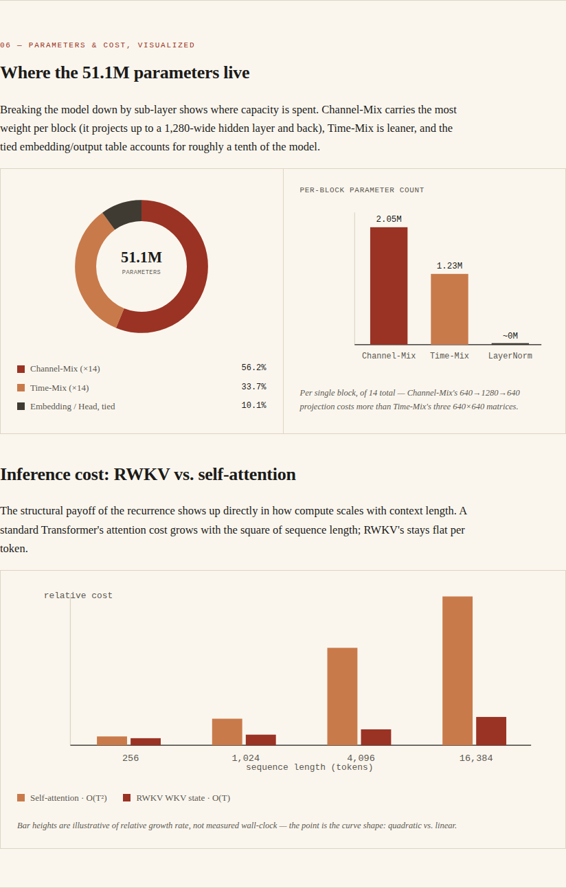

# Aether

**A 51.1M-parameter RWKV language model trained on bilingual English/Greek text**

[](https://konpep-dev.github.io/Aether-RWKV-)
[](LICENSE)
[](https://www.python.org/)
[](https://pytorch.org/)

---

## Overview

Aether is a compact language model built on the **RWKV v4 architecture** — a recurrent neural network that trains like a Transformer but runs with **O(T) linear complexity** instead of O(T²) quadratic attention.

**Key Features:**
- **51.17M parameters** — 14 layers, 640 hidden dimensions
- **No attention matrix** — constant memory per token
- **Runs on CPU** — no GPU required for inference
- **Bilingual** — trained on 500MB synthetic English & Greek text
- **8,192-token vocabulary** — byte-level BPE tokenizer


---

## Architecture

RWKV replaces self-attention with a **recurrent WKV mechanism**:

- **Time-Mix layer**: Linear-time recurrent state updates (numerator/denominator accumulators)
- **Channel-Mix layer**: Gated feed-forward network with squared-ReLU activation
- **No KV cache**: Fixed-size state per layer, independent of context length

```
Input → Embedding → [Block × 14] → LayerNorm → Linear Head → Output
         ↓
    Block = LayerNorm → Time-Mix → Residual → LayerNorm → Channel-Mix → Residual
```

**Complexity:**
- Training: O(T) per token (parallelizable like Transformers)
- Inference: O(1) per token (constant memory, no cache growth)



---

## Quick Start

### Installation

```bash
git clone https://github.com/konpep-dev/Aether-RWKV-.git
cd Aether-RWKV-
pip install -r requirements.txt
```

### Chat with Aether

```bash
python inference.py
```

**Options:**
```bash
python inference.py --temp 0.7 --topk 40 --maxtokens 100
python inference.py --quick "What is machine learning?"
python inference.py --novis  # Disable live visualization
```

### Train Your Own Model

```bash
python train.py
```

Resume from checkpoint:
```bash
python train.py --resume checkpoints/checkpoint_best.pt
```

---

## Project Structure

```
aether/
├── model.py              # RWKV v4 architecture implementation
├── train.py              # Training loop with AMP, gradient accumulation
├── inference.py          # Interactive chat with live visualization
├── tokenizer.py          # Byte-level BPE tokenizer
├── generate_dataset.py   # Synthetic dataset generator
└── requirements.txt      # Dependencies
```

---

## Dataset

**Aether Dataset Generator v6** — rule-based synthetic corpus:

- **40 subjects** (20 English + 20 Greek)
- **~500MB total** (~100M tokens)
- **60% raw paragraphs** — flowing text with 3–7 facts per paragraph
- **30% Q&A pairs** — question-answer format
- **10% multi-turn conversations** — dialog sequences



**Tokenizer:**
- Byte-level BPE (no OOV tokens)
- 8,192 vocabulary (256 bytes + 7,936 merges)
- Handles any Unicode language without fallback

---

## Training Configuration

| Parameter | Value |
|-----------|-------|
| Hidden size | 640 |
| Layers | 14 |
| Vocabulary | 8,192 |
| Batch size | 64 (micro) × 4 (accum) = 256 effective |
| Epochs | 3 |
| Learning rate | 3e-4 → 1e-5 (cosine decay) |
| Optimizer | AdamW (weight decay 0.1) |
| Precision | AMP fp16 (CUDA) / fp32 (CPU) |



---

## Model Card

Full technical documentation, architecture diagrams, and training details:

👉 **[View Interactive Model Card](https://konpep-dev.github.io/Aether-RWKV-/)**

> **Note**: The interactive model card includes complete architecture breakdowns, training hyperparameters, dataset statistics, RWKV mechanism explanations, and performance visualizations.



---

## Performance

- **Model size**: ~195 MB (fp32), ~98 MB (fp16)
- **Inference speed**: ~5–10 tokens/sec on CPU (no GPU)
- **Memory**: O(1) per token (constant state size)
- **Context length**: Unlimited (recurrent architecture)



---

## Requirements

```
torch>=2.0.0
numpy>=1.24.0
tqdm>=4.65.0
```

**Optional:**
- CUDA toolkit for GPU training
- `colorama` (Windows terminal colors)

---

## License

MIT License — see [LICENSE](LICENSE) for details.

---

## Citation

```bibtex
@software{aether2026,
  author = {Konpep},
  title = {Aether: A 51M-parameter RWKV language model},
  year = {2026},
  url = {https://github.com/konpep-dev/Aether-RWKV-}
}
```

---

## References

- **RWKV**: [RWKV: Reinventing RNNs for the Transformer Era](https://arxiv.org/abs/2305.13048)
- **Architecture**: RWKV v4 with v7-inspired optimizations
- **Dataset**: Custom synthetic bilingual corpus

---

## Acknowledgments

Built on the RWKV architecture by Bo Peng and the RWKV community.

---

**Made with ❤️ by Konpep**
